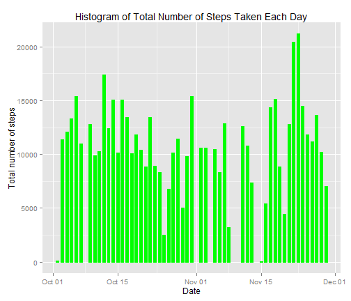
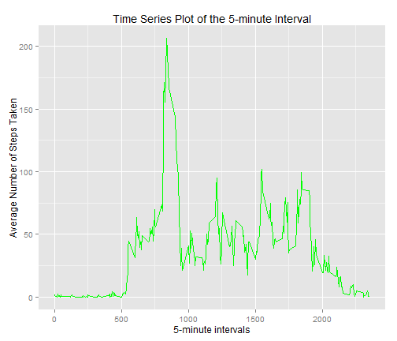
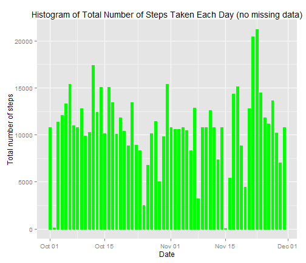

## Loading and preprocessing the data

Loading Necessary Graphics Package


```r
library (ggplot2)
library (lattice)
```

#### 1. Load the data (i.e. read.csv()) 

```r
#### The data is downloaded from source provided in Coursera Project 1 that link to
#### https://www.coursera.org/learn/reproducible-research/peer/gYyPt/course-project-1
#### colClasses is used because it removes to call "method" for  conversion from "character" to the specified formal class.

activity_data <- read.csv("./data/activity.csv", colClasses = c("integer", "Date", "factor"))
```

#### 2. Process/transform the data suitable for analysis

```r
#### extract month from date into numeric form
activity_data$month <- as.numeric(format(activity_data$date, "%m"))

#### complete cases used to consider only complete data.
complete_activity_data <- activity_data[complete.cases(activity_data),]
```


## What is mean total number of steps taken per day?

#### 1. Calculate the total number of steps taken per day

```r
totalSteps_ondate <- tapply(complete_activity_data$steps, complete_activity_data$date, sum)
```

#### 2. Creating a histogram of the total number of steps taken each day

```r
ggplot(complete_activity_data, aes(date, steps)) + geom_bar(stat = "identity", colour = "green", fill = "green", width = 0.6) + labs(title = "Histogram of Total Number of Steps Taken Each Day", x = "Date", y = "Total number of steps")
```

 

#### 3. Calculate and report the mean and median of the total number of steps taken per day

```r
mean(totalSteps_ondate)
```

```
## [1] 10766.19
```

```r
median(totalSteps_ondate)
```

```
## [1] 10765
```

```r
summary(totalSteps_ondate)
```

```
##    Min. 1st Qu.  Median    Mean 3rd Qu.    Max. 
##      41    8841   10760   10770   13290   21190
```

##  What is the average daily activity pattern?

#### 1. Time series plot of the 5-minute interval (x-axis) and the average number of steps taken, averaged across all days (y-axis)

```r
average_steps <- aggregate(complete_activity_data$steps, list(interval = as.numeric(as.character(complete_activity_data$interval))), FUN = "mean")
names(average_steps)[2] <- "meanOfSteps"
ggplot(average_steps, aes(interval, meanOfSteps)) + geom_line(color = "green", size = 0.6) + labs(title = "Time Series Plot of the 5-minute Interval", x = "5-minute intervals", y = "Average Number of Steps Taken")
```

 

#### 2. Which 5-minute interval, on average across all the days in the dataset, contains the maximum number of steps?

```r
average_steps[average_steps$meanOfSteps == max(average_steps$meanOfSteps), ]
```

```
##     interval meanOfSteps
## 104      835    206.1698
```

## Imputing missing values  

#### 1. The total number of missing values in the dataset (i.e. the total number of rows with NAs)

```r
numMissingValues <- length(which(is.na(activity_data$steps)))
```

#### 2. Devise a strategy for filling in all of the missing values in the dataset. 

#### 3. Create a new dataset that is equal to the original dataset but with the missing data filled in.

The dataset is created to fill all missing values as follows


```r
### I am using R version 3.2.2. I am unable to download the package "impute" for this version
### So I assign the missing values as follows using average_steps$meanOfSteps

new_activity_data <- activity_data 
for (i in 1:nrow(new_activity_data)) {
  if (is.na(new_activity_data$steps[i])) {
    new_activity_data$steps[i] <- average_steps[which(new_activity_data$interval[i] == average_steps$interval), ]$meanOfSteps
  }
}
head(new_activity_data)
```

```
##       steps       date interval month
## 1 1.7169811 2012-10-01        0    10
## 2 0.3396226 2012-10-01        5    10
## 3 0.1320755 2012-10-01       10    10
## 4 0.1509434 2012-10-01       15    10
## 5 0.0754717 2012-10-01       20    10
## 6 2.0943396 2012-10-01       25    10
```

```r
#### Checking the number of missing value in new dataset
numMissingValues <- length(which(is.na(new_activity_data$steps)))
numMissingValues
```

```
## [1] 0
```

#### 4. Make a histogram of the total number of steps taken each day 

```r
ggplot(new_activity_data, aes(date, steps)) + geom_bar(stat = "identity",
                                             colour = "green",
                                             fill = "green",
                                             width = 0.6) +  labs(title = "Histogram of Total Number of Steps Taken Each Day (no missing data)", x = "Date", y = "Total number of steps")
```

 

#### 5. Calculate and report the mean and median total number of steps taken per day

```r
new_totalSteps_ondate <- tapply(new_activity_data$steps, new_activity_data$date, sum)
mean(new_totalSteps_ondate)
```

```
## [1] 10766.19
```

```r
median(new_totalSteps_ondate)
```

```
## [1] 10766.19
```

```r
summary(new_totalSteps_ondate)
```

```
##    Min. 1st Qu.  Median    Mean 3rd Qu.    Max. 
##      41    9819   10770   10770   12810   21190
```
There isnont significant change after populating N/A values. The median becomes little higher than before but summary seems to be same.

## Are there differences in activity patterns between weekdays and weekends?

#### 1. Create a new factor variable in the dataset with two levels - "weekday" and "weekend" 

```r
new_activity_data$dateType <-  ifelse(as.POSIXlt(new_activity_data$date)$wday %in% c(0,6), 'weekend', 'weekday')
table(new_activity_data$dateType)
```

```
## 
## weekday weekend 
##   12960    4608
```

#### 2. Panel plot for a time series plot of the 5-minute interval (x-axis) and the average number of steps  taken, averaged across all weekday days or weekend days (y-axis)

```r
avg_new_activity_data <- aggregate(steps ~ interval + dateType, data=new_activity_data, mean)
avg_new_activity_data <- aggregate(new_activity_data$steps, list(interval = as.numeric(as.character(new_activity_data$interval)), weekdays=new_activity_data$dateType),FUN = "mean")
names(avg_new_activity_data)[3] <- "meanOfSteps"
xyplot(avg_new_activity_data$meanOfSteps ~ avg_new_activity_data$interval | avg_new_activity_data$weekdays, 
       layout = c(1, 2), type = "l", 
       xlab = "Interval", ylab = "Number of steps")
```

 
